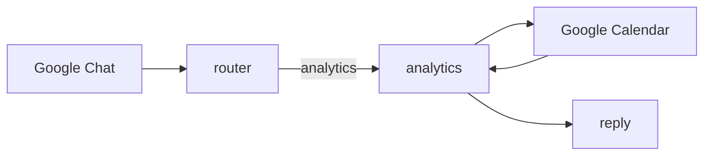
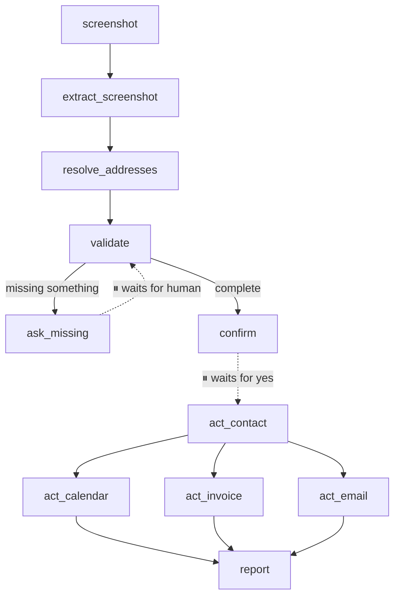

# Understanding the Ops Agent

A guided tour of this codebase, written for someone who wants to build the next
one. It assumes you can read Python but not that you know LangGraph.

Read it in order. Each part earns the next.

---

## Part 1 — Why a graph instead of a script

Here is the program you would naturally write first:

```python
fields = read_screenshot(image)
contact = create_ghl_contact(fields)
book_calendar_event(fields)
send_invoice(contact)
send_email(contact)
```

Five lines, and it looks right. It is wrong in a way that matters.

**The screenshot will be incomplete.** Customers send "moving Aug 14, 3 guys" with
no address. So the program has to stop, ask a person, and wait — and "wait" here
means minutes or hours, across a webhook, possibly across a server restart.

A normal function cannot do that. Once `read_screenshot` returns, the program is
past it. To ask a question you would have to return all the way out, store what
you had somewhere, and rebuild the state when the answer arrives — and now you
are writing a state machine by hand, badly.

**That is the whole reason this is a LangGraph app.** LangGraph programs can
genuinely stop mid-execution and resume at the same spot later. Everything else
it gives you is convenience; this is the part you cannot easily build yourself.

The second problem shows up right after: those four API calls hit three
different companies' servers. One of them *will* fail while the others succeed.
A booking that half-happens — customer texted a payment link for a truck that
was never scheduled — is worse than one that fails outright. Part 5 covers how
that is handled.

---

## Part 2 — The five ideas

Everything in LangGraph is these five. Once they click, the library is small.

### 1. State — the shared notebook

One dictionary that every step can read and write. It is the only way steps
communicate.

```python
# agent/state.py
class OpsAgentState(TypedDict):
    messages: Annotated[list, add_messages]   # the conversation
    intent: str                               # analytics | intake | chat
    intake: dict                              # the job being built up
    ledger: dict                              # what succeeded and what failed
```

The `Annotated[list, add_messages]` part matters. By default, returning a value
**replaces** what was there. `add_messages` is a *reducer* — it says "append,
don't overwrite." Get this wrong on a list and every step silently erases the
previous one's work.

### 2. Nodes — the steps

A node is a plain function: takes the state, returns *only the parts it changed*.

```python
# agent/nodes/validate_checklist.py  (simplified)
def validate_checklist(state):
    result = checklist.evaluate(state["intake"])
    return {"missing_fields": result.missing}     # a partial update
```

Never mutate the state and return it whole. Return the delta; LangGraph merges.

In this repo, `agent/nodes/` is one file per node — you can read the folder
listing and see the entire capability of the agent.

### 3. Edges — what runs next

**Static** edges always go the same place:

```python
builder.add_edge("extract_screenshot", "resolve_addresses")
```

**Conditional** edges call a function that picks:

```python
builder.add_conditional_edges("router", pick_lane, {
    "analytics": "analytics",
    "intake":    "extract_screenshot",
    "chat":      "chat",
})
```

That is how one agent does several different jobs. `router` looks at the message,
decides which lane it belongs in, and the rest of the graph is skipped.

### 4. Checkpointer — memory that survives

After every step, the entire state is saved to a database, filed under a
`thread_id`. That is what makes conversations continuous.

```python
graph.invoke(payload, {"configurable": {"thread_id": "gchat:spaces/AAA"}})
```

Same `thread_id` → same conversation. Different `thread_id` → the agent has
never met you. **This is the single most consequential value in the system**, and
Part 6 has the war story about getting it wrong.

### 5. `interrupt()` — the pause

The reason for all of the above.

```python
# agent/nodes/ask_missing.py
def ask_missing(state):
    reply = interrupt({"type": "missing_fields", "message": question})
    # ↑ execution STOPS here. Could be a second. Could be an hour.
    # ↓ resumes here, with the human's answer in `reply`
    return {"intake": parse(reply)}
```

To restart it, you send `Command(resume="...")` instead of a new message. The
answer appears as the return value of `interrupt()` and the function continues
as if nothing happened.

**One rule you must internalise:** when a node resumes, it **re-runs from the
top**. Every line above `interrupt()` executes again.

```python
def bad(state):
    send_invoice()              # runs again on EVERY resume
    answer = interrupt("ok?")   # customer billed twice, three times…
```

This repo enforces a hard version of that rule: *a node either contains an
`interrupt()` or performs a side effect — never both.* That is why
`ask_missing.py` and `confirm.py` do nothing but format a question and wait,
and every real API call lives in its own node downstream.

---

## Part 3 — Follow one real request

### "How many jobs did we have last month?"



1. `channels/google_chat.py` receives the webhook, verifies it came from Google,
   works out the `thread_id`, and calls the graph.
2. `router` classifies it as `analytics`.
3. `analytics` works out the date range, fetches the events, **counts them in
   Python**, and hands the model a finished table to phrase.
4. The reply goes back in the HTTP response.

Note step 3. The model never counts. It phrases numbers that Python computed —
because a model that miscounts is confidently, invisibly wrong, and this is a
question about the business.

### A screenshot booking



The dotted lines are the pauses. Between them the process may be shut down,
redeployed, and restarted — the booking survives, because it is in the
checkpoint database, not in memory.

`act_contact` runs before the other three because they all need the contact's
ID. The rest are independent.

---

## Part 4 — The file structure, and the rule behind it

| Folder | Contains | Knows about |
|---|---|---|
| `channels/` | How humans reach the agent (Google Chat) | the graph |
| `agent/` | The graph: state, nodes, wiring | services + schemas |
| `services/` | The outside world: GHL, Calendar, Maps, OCR | nothing internal |
| `schemas/` | Business rules as data: checklist, email, rates | nothing internal |

**The rule: dependencies point one direction only.** `services/ghl.py` has no
idea an agent exists — it just knows how to talk to GoHighLevel. `agent/` uses
services. `channels/` uses the agent.

This is what makes the system changeable. Adding Slack tomorrow means writing
one file in `channels/` and touching nothing else. That claim was tested for
real: swapping the browser UI for Google Chat did not change a single line
inside `agent/`.

The other half of the rule: **things that change often live in `schemas/`, as
data.** The booking checklist, the email wording, the rate table. Changing what
the agent asks for is editing a list — not rewiring a graph.

```
ops-agent/
├── app.py              production entry point — what Railway runs
├── server.py           local browser UI (dev)
├── chat_cli.py         local terminal chat (dev)
├── verify_services.py  checks credentials without touching the agent
│
├── agent/
│   ├── graph.py        wires the nodes together — read this first
│   ├── state.py        the shared notebook
│   ├── models.py       which model each node uses
│   └── nodes/          one file per step
│
├── services/           GHL, Calendar, Maps, OCR, formatting, rates
├── schemas/            checklist, intake shape, email template
├── channels/           google_chat.py
└── tests/
```

Two files repay reading in full: **`agent/graph.py`** (the whole shape in one
screen) and **`agent/state.py`** (everything the agent can know).

---

## Part 5 — Five patterns worth stealing

### 1. The ledger — surviving partial failure

Four API calls; some will fail. Instead of one `try` around all of them, each
action records its own outcome:

```python
{"contact":  {"status": "success", "result": {"contact_id": "abc"}},
 "calendar": {"status": "success", "result": {"event_id": "xyz"}},
 "invoice":  {"status": "failed",  "error": "422 Unprocessable"},
 "email":    {"status": "success"}}
```

Every action node starts by checking its own entry:

```python
if state["ledger"].get(ME, {}).get("status") == "success":
    return {}          # already done — do not repeat
```

Three consequences, all good: one dead API cannot abort the other three; the
user is told exactly what did and did not happen; and "retry" re-runs only what
failed. **You saw this work** — the invoice failed once, and the contact,
calendar event and email still went through.

### 2. Dry run — a real safety switch

`DRY_RUN=true` makes every write log its payload instead of sending it. Reads
still hit the live API, so you develop against real calendar data with no risk
of texting a customer. It is checked inside `services/`, not sprinkled through
the agent — one place, impossible to forget.

Note the default:

```python
return os.getenv("DRY_RUN", "true").lower() not in ("false", "0", "no")
```

Missing or misspelled means **safe**. A config typo must never mean "go live".

### 3. Rules as data

```python
FieldSpec(
    name="phone",
    ask="What's the customer's phone number?",
    normalizer=format_phone,
    required=True,
)
```

Adding a question to the booking flow is adding an entry to a list. No graph
change, no new node. When you build your own agent, find the part the business
will want to change monthly and push it into a structure like this.

### 4. Channels as adapters

`channels/google_chat.py` translates one messaging platform into the two things
the graph understands — *a new message* or *a resume value* — and translates
the answer back. It contains zero booking logic.

### 5. Python for facts, the model for language

| Job | Who does it |
|---|---|
| Counting jobs, summing revenue | Python |
| Validating the checklist | Python |
| Reading a screenshot | model |
| Understanding "next Friday, 3 guys" | model |
| Phrasing the answer | model |

Models are good at ambiguous input and natural phrasing, and untrustworthy at
arithmetic and rule-checking. Split the work accordingly.

---

## Part 6 — Traps, from this build

These are real. Each cost real debugging time.

### The `thread_id` that changed every message

Keyed on Google Chat's *thread* name. Every new message creates a new thread, so
every message got a new ID — and the agent looked up a conversation that did not
exist.

It never errored. It answered normally, using only the latest message, silently
discarding a screenshot's worth of data. It looked like forgetting, not failing.

**Lesson:** an unstable conversation key produces amnesia, not exceptions. Pin
it with a test.

### The branch that failed silently

```python
return claims.get("email") == CHAT_ISSUER    # returns False, says nothing
```

Every request was rejected with a bare 401 — no log, no reason. Diagnostics
added to find the bug did not cover the one line causing it.

**Lesson:** every rejection path must say why. A boolean return in an auth check
is a place bugs hide.

### The database that closed itself

```python
manager = SqliteSaver.from_conn_string(path)
return manager.__enter__()      # `manager` dies here; the DB closes with it
```

The app booted clean and served health checks for minutes. The first real
message failed with "Cannot operate on a closed database", nowhere near the
cause.

**Lesson:** resources whose lifetime depends on a variable staying alive need
that variable to actually stay alive.

### The booking that inherited the last one

A finished booking left its customer in `intake` and its four successes in
`ledger`. Nothing cleared either. The next job in the same conversation
inherited both.

```python
merged = {**intake, **(state.get("intake") or {})}
#                    ^^^^^^^^^^^^^^^^^^^^^^^^^ the old booking wins
```

The visible half: a brand-new screenshot came back showing the *previous*
customer, because their values outranked the fresh read. The invisible half was
worse — every action node checks `if succeeded(ledger, me): return {}`, so all
four would have skipped, and the agent would have reported a booking it never
made.

The fix is not "always clear at the end", because `retry` deliberately reuses
the ledger — that is how it re-runs only the failed steps. So the intake lane
decides at its front door whether the turn *starts* a job or *continues* one.

**Lesson:** persistence is the feature you are paying for; forgetting is
something you have to implement. State survives every turn and nodes only ever
add to it. Anything that should not outlive a task needs code that ends it —
and "when exactly does this end?" is usually the harder question than "how do I
clear it?"

### Assuming one dialect

Google Chat apps registered as *Workspace add-ons* send a different payload
shape **and** require a different reply shape than classic Chat apps. Both
differences failed silently — a 200 response and nothing displayed.

**Lesson:** when integrating a platform, confirm the exact request and response
format for *your* configuration. "It returned 200" is not "it worked."

---

## Part 7 — Making changes

**Ask for one more piece of information**
→ add a `FieldSpec` in `schemas/checklist.py`. Nothing else.

**Change the confirmation email**
→ `schemas/email_template.py`. All customer-facing wording is there.

**Add a new capability** (say, "what's our revenue this month?")
1. Write `agent/nodes/revenue.py`
2. Register it in `agent/graph.py` and add a router branch
3. Teach `router` the new intent
4. Add a test

**Add a new channel** (Slack, Telegram, SMS)
→ one new file in `channels/`. Translate inbound to *message or resume*,
translate outbound back. Do not touch `agent/`.

**Always:** run `pytest` before deploying. It takes under a second and covers
the failures that do not announce themselves.

---

## Part 8 — What to learn next

You have now seen most of LangGraph. What is left, roughly in order of
usefulness:

- **Tools** — letting a model call functions itself, rather than you wiring each
  step. Good when the sequence genuinely varies; worse when it does not, because
  you trade determinism for flexibility. This agent is mostly a fixed pipeline
  on purpose.
- **Streaming** — token-by-token output. `agent/progress.py` here is a simpler
  cousin: nodes emit plain-language progress lines.
- **Postgres checkpointing** — same interface as the SQLite one, needed the day
  you run more than one instance.
- **LangSmith** — see every step, every prompt, every timing of a run. The env
  vars are already in `.env.example`; set `LANGSMITH_TRACING=true`.
- **Subgraphs** — a graph used as a node. Reach for it when one file gets too
  big to hold in your head.

### The one habit worth keeping

The valuable thinking in this project was not the LangGraph API. It was asking,
repeatedly: **what does this look like when it fails?**

Every design decision that earned its keep came from that question. The ledger
exists because four API calls fail independently. The dry-run switch exists
because "test it in production" means texting a real customer. The tests cluster
around silent failures because loud ones announce themselves.

When you build the next agent with Claude Code, that is the question to keep
asking out loud. The code is the easy part.
